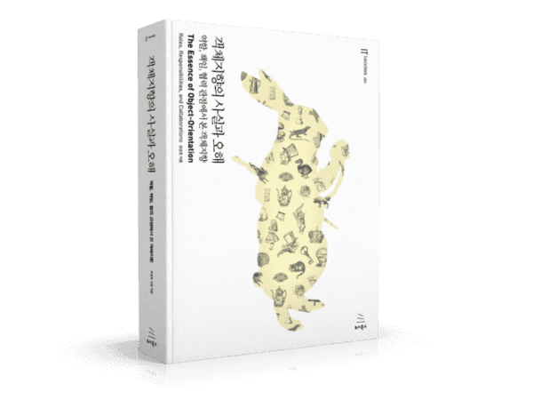

# 🍌 Welcome to baNaNa's Study


baNaNa는객체지향의 본질을 탐구하고, 단순한 개념 암기가 아닌 깊이 있는 이해와 실무 적용을 목표로 하는 스터디입니다. 책을 읽고 토론하며, 기술 면접 대비와 코드 적용까지 연결하는 실전 학습 방식을 추구합니다.


<figure><figcaption></figcaption></figure>

***

## Overview


[undefined.md](overview/undefined.md)



[undefined-1.md](overview/undefined-1.md)


***

## Wiki의 목적

> 🔹 <mark style="color:yellow;">단순 필사가 아닌</mark>, 우리만의 지식 저장소\
> 🔹 기술 면접 대비 – 핵심 개념, 꼬리 질문, 토론 정리\
> 🔹 이론과 코드 적용을 연결하는 실전 학습\
> 🔹 누구나 쉽게 찾아보고 기여할 수 있는 구조 구축
